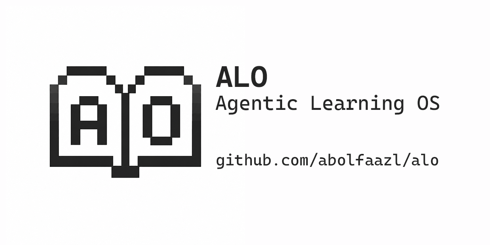

# ALO — Agentic Learning OS



Turn any folder into a learning workspace.

ALO is a local-first CLI/TUI for building a personal learning system around any subject. It keeps your profile, roadmap, lessons, weaknesses, reviews, and progress in Markdown files you can read, edit, and commit.

[](https://pypi.org/project/alo-learning-os/)
[](https://www.python.org/downloads/)
[](https://github.com/abolfaazl/alo/actions)
[](https://opensource.org/licenses/MIT)

## Quick Install

```bash
pip install alo-learning-os
alo
```

Check the installation:
```bash
alo version
alo doctor
```

*(Note: The PyPI distribution name is `alo-learning-os`. The installed command is `alo`.)*

## Why ALO?

Most learning starts with enthusiasm and then disappears into scattered notes, unfinished tutorials, lost context, too many tabs, and generic study plans with no real review loop or progress history.

ALO’s answer is simple:
- One folder per subject
- Markdown state files
- A personal roadmap tailored to you
- Daily focused learning sessions
- Built-in review loop for your weaknesses
- Safe Git history to track progress

## What It Feels Like

```bash
pip install alo-learning-os
mkdir my-python-learning
cd my-python-learning
alo
```

The workflow is straightforward. You can use the interactive dashboard (`alo`) or direct CLI commands:
`init → config → paths → roadmap → learn → review → sync`

## Terminal Preview

```text
$ alo doctor
Checks Python, Git, workspace status, and LLM readiness.

$ alo paths
Generates learning path options based on your profile.

$ alo learn
Starts a focused learning session from the current roadmap.
```

*(Screenshots and a short demo GIF are planned).*

## Workspace File Tree

Nothing is hidden in a database. Nothing is locked inside a web app. The workspace is just files.

```text
my-python-learning/
├─ learning-profile.md
├─ skill-map.md
├─ learning-paths.md
├─ roadmap.md
├─ weaknesses.md
├─ progress-log.md
├─ tutor-rules.md
└─ privacy-rules.md
```

## What ALO is not

- Not a course marketplace
- Not a hosted learning platform
- Not a notes app
- Not a chatbot skin

ALO is the layer that keeps your learning process organized.

## Who It’s For

- Developers learning new stacks
- Designers learning product/UX
- Product managers building structured knowledge
- Students who want versioned learning notes
- Self-learners who want a review loop

## Workspace Files

These are normal Markdown files. You own them. You can read them. You can edit them. You can commit them.

| File | Description |
|---|---|
| `learning-profile.md` | Your background, learning goals, and experience level |
| `skill-map.md` | An ongoing map of skills you've acquired or are currently targeting |
| `learning-paths.md` | Proposed learning paths generated by the LLM based on your profile |
| `roadmap.md` | The detailed step-by-step curriculum for your active learning path |
| `weaknesses.md` | A tracked list of concepts you need to review and practice more |
| `progress-log.md` | A log of lessons completed, assessments, and daily progress |
| `tutor-rules.md` | Custom instructions for how the LLM should teach and interact |
| `privacy-rules.md` | Rules detailing what context the LLM is allowed or forbidden to use |

## LLM Configuration

ALO supports LLM-assisted features for generating personalized roadmaps and lessons.

**Safe API Guidance:**
- **Recommended**: `keyring` mode (stores securely in your OS credential manager)
- **Alternative**: `env` mode (reads from an environment variable name)
- **Never** paste keys into Markdown
- **Never** commit keys

Example for OpenAI-compatible providers:
```text
Provider: openai-compatible
Base URL: https://api.example.com/v1
Model: gpt-4o-mini
Storage: keyring
```

## Git Sync Safety

ALO takes Git sync seriously to prevent accidental secret leaks or unwanted file tracking.

- ALO never uses `git add .`
- Only known learning files are staged.
- Unsafe staged files block sync.
- Secret-looking content blocks commits.
- Dry-run is available.

```bash
alo sync --dry-run
alo sync --no-push
```

## Commands

| Command | Description |
|---|---|
| `alo` | Opens the interactive dashboard TUI |
| `alo doctor` | Checks environment health, Python version, and Git status |
| `alo version` | Displays the current installed version |
| `alo init` | Initializes a new workspace and generates profile files |
| `alo config` | Configures the LLM provider, model, and secure credential storage |
| `alo paths` | Generates personalized learning paths based on your profile |
| `alo roadmap` | Builds a detailed curriculum for your chosen path |
| `alo learn` | Starts a daily learning and practice session |
| `alo review` | Initiates a review session focused on past weaknesses |
| `alo sync` | Safely commits changes to Markdown state files and pushes to remote |
| `alo readme` | Generates a workspace README.md portfolio (options: `--include-charts --include-gamification`) |
| `alo charts` | Generates local SVG progress charts in assets/ |
| `alo badges` | Displays local gamification summary and earned badges |
| `alo status` | Summarizes the current workspace state and momentum |

## Mock Mode / Offline Demo

Mock mode is useful for trying the workflow without an API key.

```bash
alo paths --mock
alo roadmap --mock
alo learn --mock
alo review --mock
```

## Roadmap

See [v1.1.0 planning](docs/roadmap-v1.1.md) for the next milestone.

- **Now:** workspace README generator, learning stats, progress charts, streaks
- **Later:** roadmap import, examples gallery, richer dashboard UX

*(Note: `roadmap.sh`-compatible import is future research, not current functionality.)*

## Current Limitations

- Python 3.12+ only
- LLM features require a configured provider unless mock mode is used
- Screenshots/GIF are not added yet
- Direct roadmap.sh integration is not implemented yet

## Security

Please refer to [SECURITY.md](SECURITY.md) for vulnerability reporting instructions.

Do not paste API keys into issues.
ALO is designed to avoid storing raw keys in project files.

## Contributing

Bug reports, docs fixes, UX feedback, and roadmap ideas are welcome.

## License

This project is licensed under the [MIT License](LICENSE).

## Troubleshooting / Config

**Where ALO stores config:**
Configuration is stored securely using your operating system's standard user configuration directory (e.g., ~/.config/ALO/ALO/config.json on Linux, AppData\Local\ALO\ALO\config.json on Windows).

**How to change provider/base URL:**
Run lo config to update your provider, model, base URL, and key storage preferences. Alternatively, use the interactive dashboard by running lo and navigating to **Settings**.

**How to test API connection:**
You can test your connection in the TUI (interactive dashboard) by pressing T or selecting "Test API Connection" in the Settings menu.

**What to do if settings look wrong:**
Your config is preserved safely. If a config file becomes invalid, ALO creates a timestamped backup and uses safe defaults. Open Settings in lo and save again to repair. For partial configurations, ALO will explicitly list the missing required fields (like Base URL).

**API Keys are not printed:**
ALO never prints or exposes raw API keys in logs, terminal outputs, or config menus. It will only indicate whether a key is configured correctly in the keyring or environment variables.
